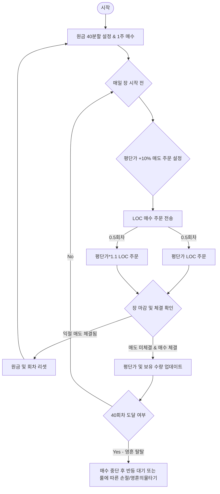

# 라오어의 무한매수법 (Infinite Buying Strategy)

"라오어의 무한매수법"은 미국 주식 시장의 3배 레버리지 ETF를 대상으로, 원금을 분할하여 매일 기계적으로 매수함으로써 평단가를 낮추고, 목표 수익률(+10%) 달성 시 전량 매도하여 수익을 확정하는 정량적 매매 전략입니다.

---

## 1. 핵심 매매 규칙 (Core Rules)

### ① 원금 분할 (Capital Division)
* 전체 투자 원금을 **40분할**하여 하루 매수 한도액(1회차 금액)을 설정합니다.
  * *예: 원금이 $10,000인 경우, 하루 매수 한도액은 $250입니다.*

### ② 대상 종목 조건 (Ticker Selection)
* '매일' 최소 매수 가능 수량이 **2주 이상**이어야 합니다.
  * 즉, 1주당 가격이 **하루 매수 한도액의 절반(0.5회차) 이하**인 종목만 거래합니다.
  * *예: 하루 한도액이 $250인 경우, 주당 가격이 $125 이하인 종목을 선택합니다.*
  * 주 대상 종목: **TQQQ (ProShares UltraPro QQQ), SOXL (Direxion Daily Semiconductor Bull 3X Shares), UPRO (ProShares UltraPro S&P500)** 등 미국 3배 레버리지 ETF.

### ③ 계좌 및 원금 분리 (Account Separation)
* 여러 종목을 동시에 운용할 경우, 각 종목마다 원금을 철저히 분리하고 절대 섞지 않습니다.
* 한 종목의 매수가 시작되면 해당 원금은 매도가 완료될 때까지 다른 용도로 전용하지 않습니다.

### ④ 최초 진입 (Initial Entry)
* 첫 번째 날(1회차)에는 시장가 또는 장중에 **1주**를 매수하여 시작합니다.

### ⑤ 일일 매수 주문 방식 (Daily Order Method - LOC)
매일 장 시작 전에 **LOC(Limit On Close, 장마감 지정가)** 주문을 사용하여 다음 두 갈래로 나누어 매수 주문을 제출합니다.

1. **지정가 LOC 매수 (0.5회차)**
   * 주문 수량 = `(하루 매수 한도액 * 0.5) / 현재 평단가`
   * 주문 가격 = **나의 현재 평단가**
   * *효과: 장마감 종가가 내 평단가 이하일 때만 체결되어 평단가를 낮추는 데 기여합니다.*
2. **무체결 방지 LOC 매수 (0.5회차)**
   * 주문 수량 = `(하루 매수 한도액 * 0.5) / 현재가(또는 전일종가)`
   * 주문 가격 = **현재가(또는 전일종가) 대비 +10% 높은 가격**
   * *효과: 종가가 주문 가격 이하일 때 체결되는데, 주문 가격이 시장 가격보다 훨씬 높으므로 당일 종가(시장가)로 100% 무조건 체결됩니다. 주가가 상승하는 장에서도 최소한의 매수를 보장합니다.*

> **[장중 매수 옵션]**
> 장중에 실시간 주가가 내 평단가보다 낮을 경우, 당일 LOC 주문을 제출하는 대신 장중에 직접 1회차 분량을 매수해도 됩니다. 단, 이 경우 당일 추가 LOC 주문은 내지 않습니다 (1일 1회차 제한).

### ⑥ 일일 매수 한도 준수 (Daily Limit)
* 매일 1회차씩만 매수를 시도합니다.
* 어제 0.5회차만 체결되었다고 해서 오늘 1.5회차를 매수하지 않습니다. 매일 동일하게 1회차 한도 내에서 주문을 생성합니다.
* 주가가 하락하면 정해진 금액 범위($250) 내에서 살 수 있는 주식 수가 늘어나므로 자동으로 수량을 조절합니다.

### ⑦ 익절 매도 (Take Profit)
* **매일 나의 현재 평단 대비 +10% 높은 가격에 전량 매도** 주문을 걸어놓습니다.
* 장중에 이 가격에 도달하면 전량 매도되어 수익을 실현합니다. 증권사의 자동 주문 감시(스톱로스 또는 지정가 예약 매도) 기능을 활용합니다.

### ⑧ 사이클 리셋 (Reset & Restart)
* +10% 지점에서 매도가 완료되면 해당 사이클은 종료됩니다.
* 매도 당일 밤에 LOC 매수 주문이 들어가 체결되었더라도, 매도 성공 즉시 모든 상태를 리셋하고 다시 1단계(최초 1주 매수)로 돌아가 새 사이클을 시작합니다.

---

## 2. 알고리즘 흐름도 (Algorithm Flow)

---

## 3. 백테스팅 검증 포인트
1. **수익률 및 MDD**: 3배 레버리지 ETF의 큰 변동성 하에서 40분할이 원금 소진 전에 익절 사이클을 돌릴 수 있는지 검증.
2. **평균 사이클 소요 기간**: 한 사이클이 시작해서 익절(+10%) 매도될 때까지 걸리는 평균 일수 분석.
3. **40회차 소진 빈도**: 40회차 내에 익절하지 못하고 원금이 전액 소진되는 상황(소위 '영혼 탈탈' 상태)이 발생하는 빈도 및 대처 전략 검증.

---

## 4. 백테스팅을 통해 본 전략의 특징 및 한계 (Analysis & Limitations)

백테스팅 결과를 통해 분석한 무한매수법의 주요 특징 및 한계점은 다음과 같습니다.

### ① 최대 진행회차가 40회가 안 되는 이유
* **익절 시 즉시 리셋**: 분할 매수를 진행하다가 장중 고가가 내 평단가 대비 **+10%**에 도달하면 즉시 전량 매도하고 사이클을 종료합니다.
* **조기 익절 빈도**: 완만한 횡보장이나 상승장에서는 40회차를 다 채우기 전에(보통 5~15회차 이내) 조기 익절되어 1회차로 리셋되는 경우가 훨씬 많습니다. 따라서 개별 사이클의 최대 진행회차는 40회에 미치지 못하는 경우가 대부분입니다.

### ② 누적 수익률이 단순 보유(Buy & Hold) 대비 상대적으로 낮은 원인
* **현금 드래그 (Cash Drag) 현상**:
  * 원금을 40분할하여 매일 2.5%씩만 매수하기 때문에, 4~5회차 만에 빠르게 익절되면 해당 회차 투입 금액 대비 수익률은 +10%이지만, **전체 투자 원금 대비 수익률은 0.5%~1% 수준**에 불과합니다.
  * 전체 자산의 상당 부분이 매일 예수금(현금) 상태로 묶여 있어 상승장에서 자금 효율성이 크게 떨어집니다.
* **원금 소진 시의 추가 방어력 부재**:
  * 거대한 하락장(예: 2022년)을 만나 40회차를 모두 소진하고 원금이 100% 주식에 묶이게 되면(영혼 탈탈 상태), 추가 매수를 통한 평단가 인하가 불가능합니다.
  * 이 상태에서 주가가 회복될 때까지 긴 시간 동안 물려 있게 되며, 기회비용 손실로 인해 누적 수익률이 감소하게 됩니다.
* **3배 레버리지의 변동성 잠식 (Volatility Decay)**:
  * 3배 레버리지 ETF는 횡보장이나 하락-상승 반복 장세에서 음의 복리 효과로 인해 기초자산이 제자리로 돌아오더라도 가치가 갉아먹힙니다. 무한매수법이 평단가를 낮춰주지만 장기 횡보 시 누적 수익률에 악영향을 미칩니다.

### ③ 요약 및 제언
* 무한매수법은 **대세 상승장에서 높은 수익률을 거두기 위한 전략이 아닙니다.**
* 극심한 변동성을 지닌 3배 레버리지 상품을 대상으로, **40분할이라는 현금 비중을 유지하며 폭락 위험을 제어하고, 확실한 10%의 수익을 기계적으로 반복 챙기는 "안정성 중심의 현금 회전 전략"**에 가깝습니다.
* **대처 방안**: 실제 운용 시에는 40분할 원금 외에, 40회차가 모두 소진되었을 때 평단가를 더 낮출 수 있는 **'영혼의 물타기용 예비 자금(예: 추가 20~40회차분)'**을 계좌별로 따로 준비해두는 것이 생존 확률을 크게 높일 수 있습니다.

